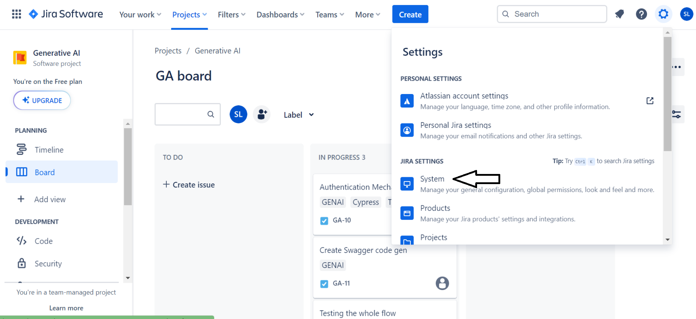
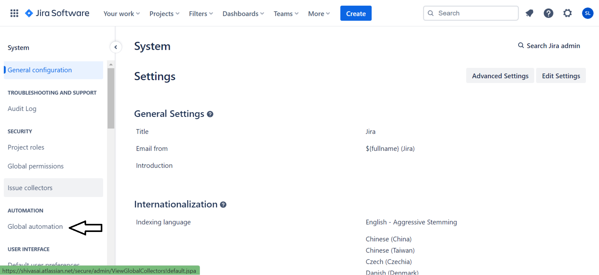
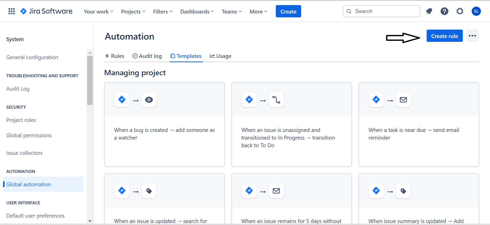
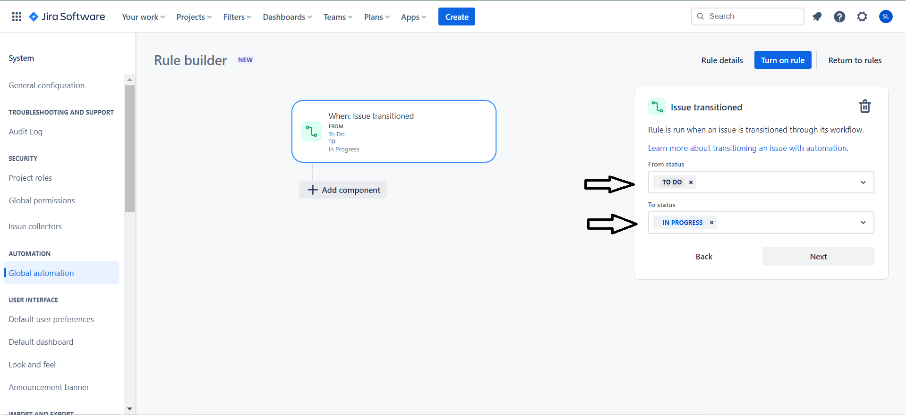
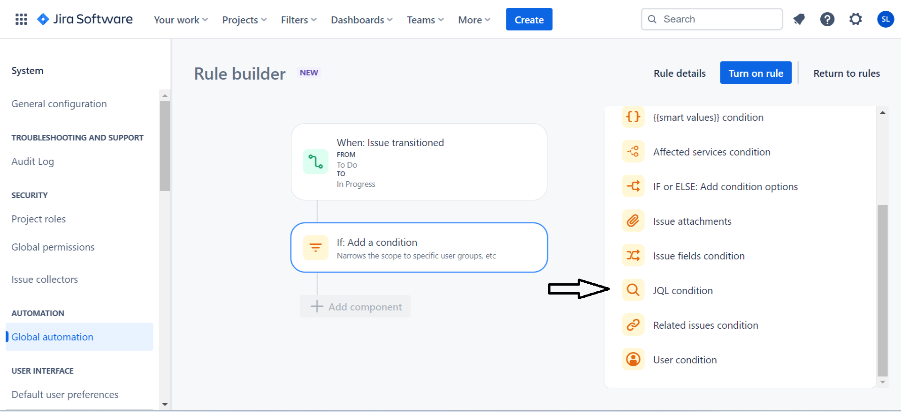
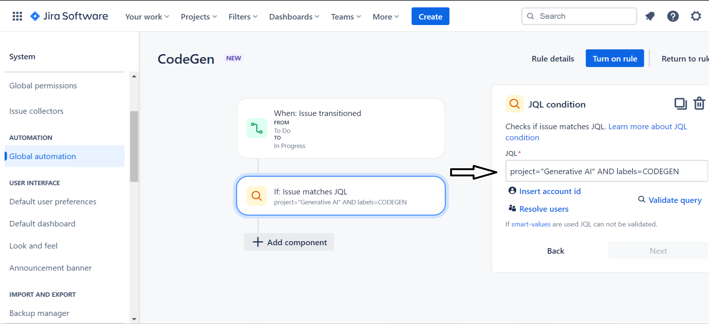
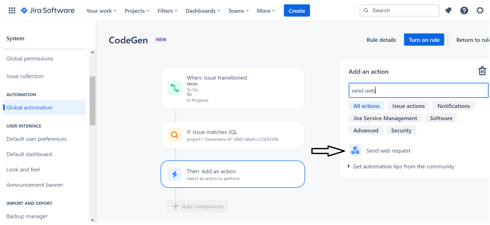
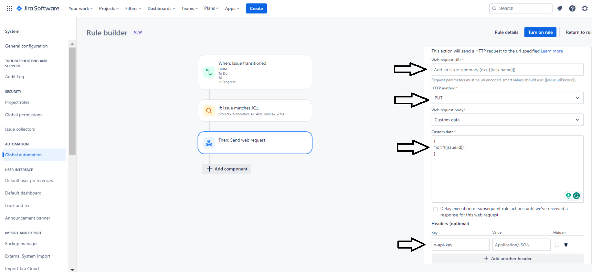
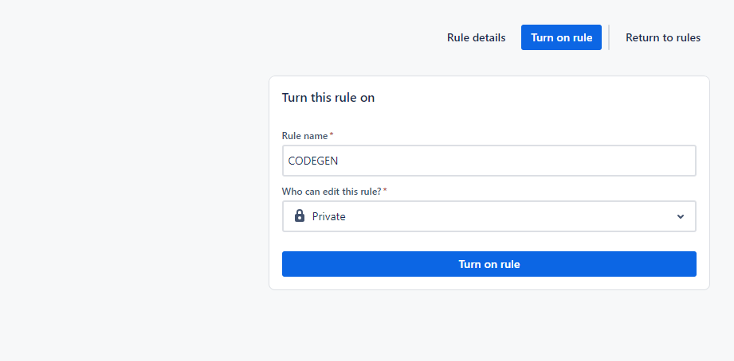

- Navigate to settings then click on the system option in the settings.
\
\



- Click on the "Global Automation".
\
\



- Click on the create rule button.
\
\



- Add a trigger for issue transitioned.
\
\


- Choose transition process from the 'TODO' status to 'IN PROGRESS'.
\
\



- Please choose the 'JQL condition' component within the 'add a condition' section.
\
\



- Include the JQL query similar to the example below, replacing 'YourProjectName' with the actual project name. Additionally, set a label for the test cases involved in the conversion of Swagger to Cypress tests.
\
\



- Please choose an action to send the web request.
\
\



- Provide the web request URL, method, custom data, and specify the header containing the 'x-api-key' key with its corresponding actual API key, as illustrated in the accompanying image
\
\



```json
{
  "id": "{{issue.id}}"
}
```

- Afterwards, proceed by clicking the 'Next' button, then activate the rule by providing the Rule name and edit access for the rule.
\
\
