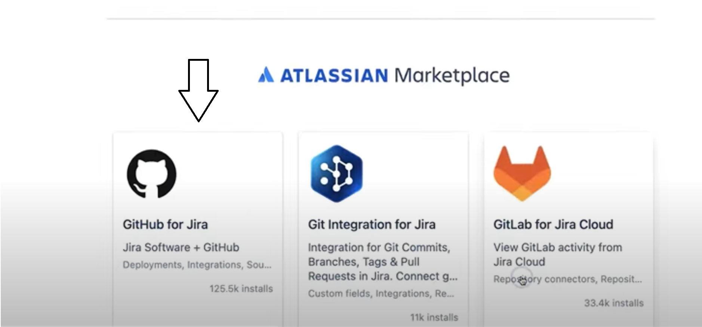
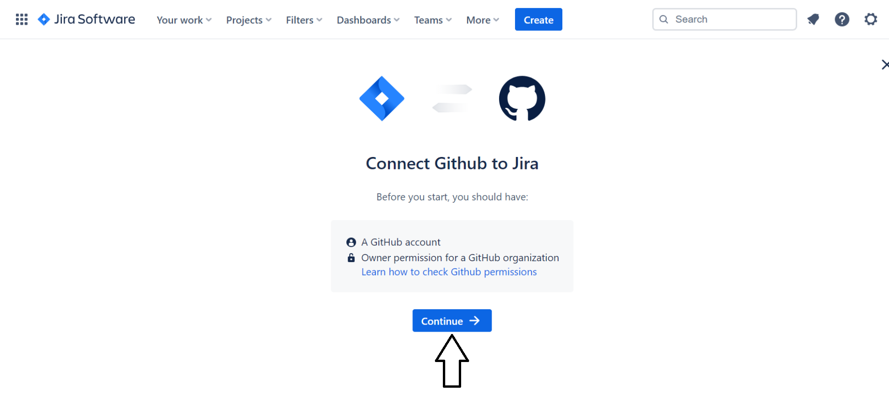
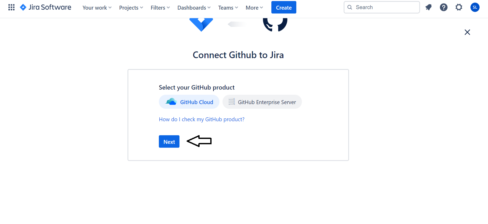
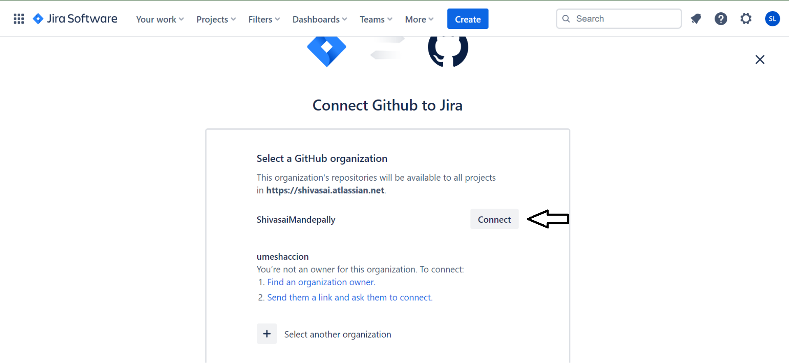
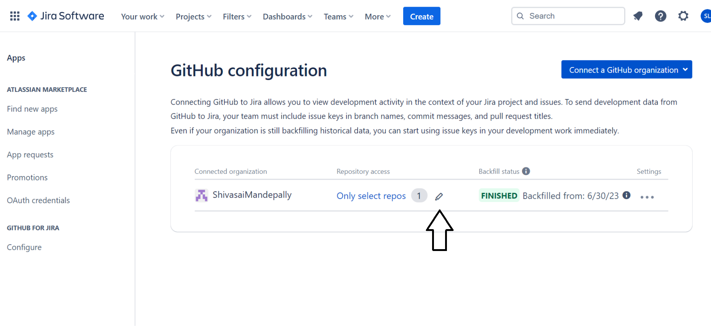
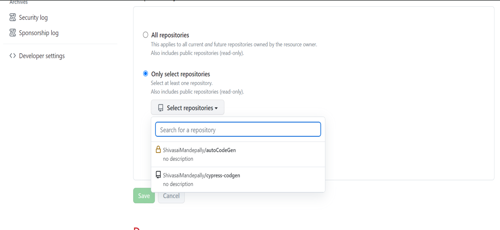

- Navigate to the code option in the development group and choose 'Connect to other Providers'
- If you are not facing any issue after clicking on this you will directly navigate to the Marketplace or else click on the Marketplace link in the bottom.
\
\

[//]: # (- Click on the browse the atlassian Marketplace.)

[//]: # (![marketPlace]&#40;marketPlace.png&#41;)

- Click on the GitHub for jira
\
\

- Click on the 'Get it now' button after the app in installed click on the get started button.
- Then connect your GitHub with the jira by clicking on the continue.
\
\

- Select your GitHub product then click on the next button.
\
\

- Connect to the GitHub Organization of your repository.
\
\

- After the connection of your GitHub to jira, click on the edit option in the GitHub configuration.
\
\

- It will redirect you to the GitHub there give access to the repository which you want to connect with jira.
\
\

***Your GitHub-Jira connection is now established. Any commits made in the selected repository with a JIRA story key will be reflected in JIRA***
