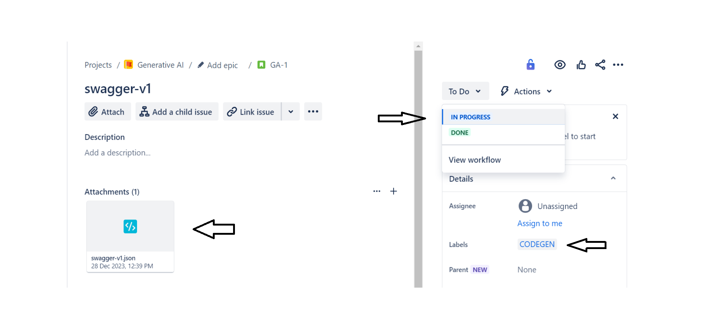
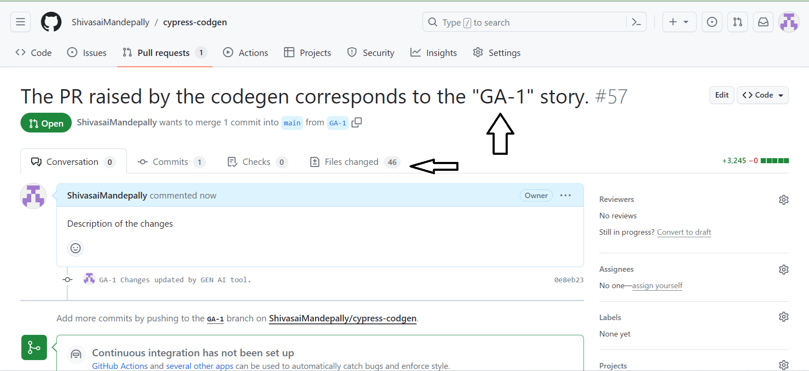
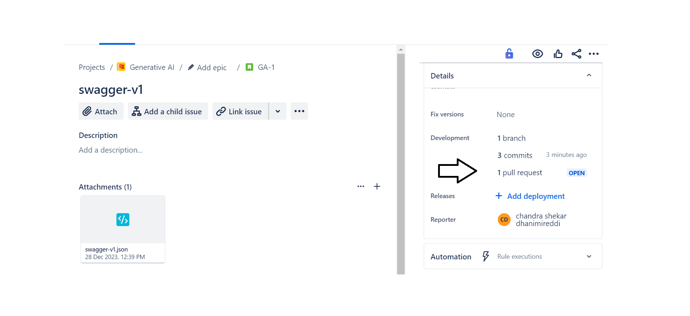

\
After the creation of the rule and successful integration of GitHub with Jira

- Create a user story and apply the specified label mentioned during rule creation.
- Attach the Swagger file within the user story.
- Transition the status from TODO to IN PROGRESS.
\
\

In a matter of seconds on GitHub, a new branch will be generated using the key name of your story, accompanied by the initiation of a pull request.
\
\

***After refreshing your Jira website, you'll observe a commit,branch and pull request linked to the user story.***
\
\

After the PR is raised, the QA engineer will review the code, and provide the input values for the configuration variables in fixture files, and subsequently assign it to the QA lead/manager. Upon approval, the QA lead/manager will proceed to merge it into the main branch
\
\