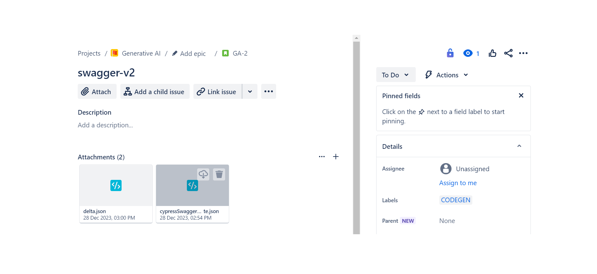

After the initial use of the codegen tool, for subsequent API updates or additions, please follow the procedure below..
- Create another story with the same label as what you have used earlier.
- Add the modified swagger file along with delta.json
\
\

\
\
**In the delta file, document the objects that have been created, updated, or deleted.**

***Sample delta file***:
```json
{
  "serverUrl": "https://petstore.swagger.io/v2",
  "operation": "UPDATE",
  "updateInfo": [
    {
      "tags": [
        "pets"
      ],
      "methods": [
        "get"
      ],
      "apiEndpoint": "/pet/findByStatus",
      "operationId": "findPetsByStatus",
      "operation": "UPDATE"
    },
    {
      "tags": [
        "pets"
      ],
      "methods": [
        "put"
      ],
      "apiEndpoint": "/pet/{petId}",
      "operation": "CREATE"
    },
    {
      "tags": [
        "pets"
      ],
      "methods": [
        "get"
      ],
      "apiEndpoint": "/pet/findByTags",
      "operation": "DELETE"
    }
  ]
}
```

Shortly after, a new branch will be created, named after the JIRA key, and a pull request will be initiated.

This is the process to perform updates for the Cypress code within the regression process.

