# codegen
Codegen is a tool that converts Swagger files adhering to OpenAPI 3.X standards into Cypress tests.
It offers integration with project management tools such as Jira and source code repository platforms like GitHub.
The process to integrate with jira is:

**1. Create an Automation Rule for jira**
- Navigate to settings then click on the system option in the settings.
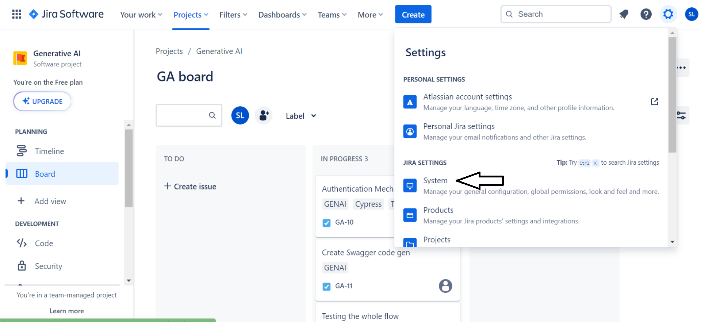


- Click on the "Global Automation".
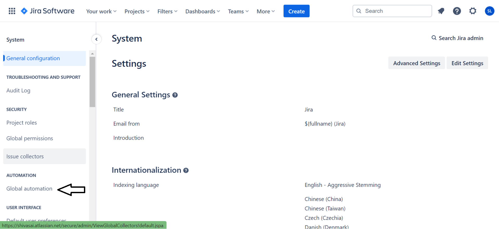


- Click on the create rule button.
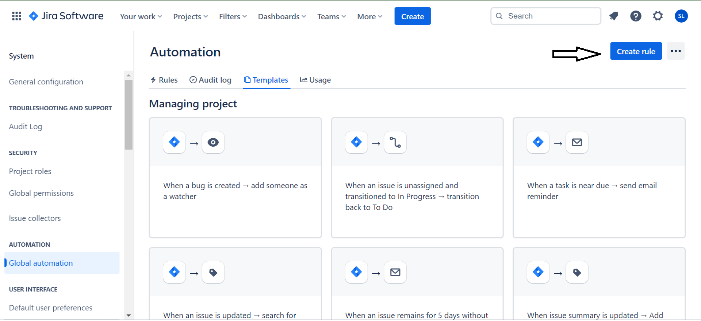


- Add a trigger for issue transitioned.
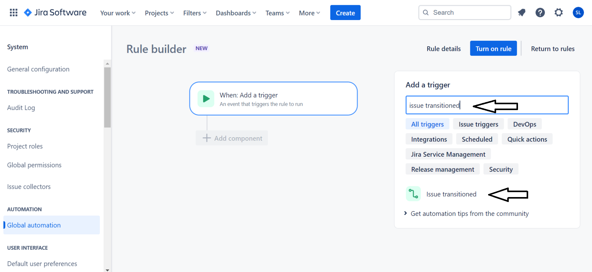


- Choose transition process from the 'TODO' status to 'IN PROGRESS'.
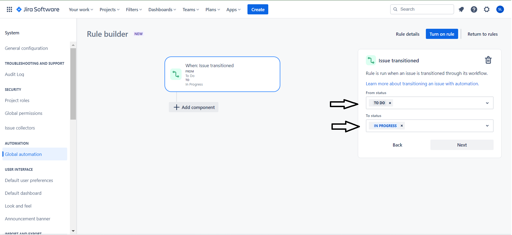


- Please choose the 'JQL condition' component within the 'add a condition' section.
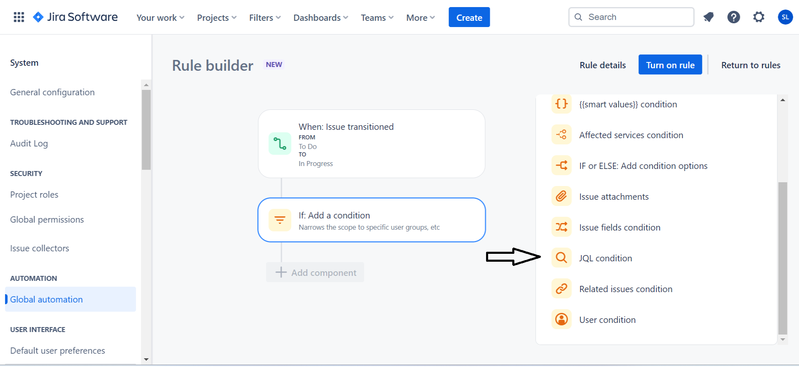


- Include the JQL query similar to the example below, replacing 'YourProjectName' with the actual project name. Additionally, set a label for the test cases involved in the conversion of Swagger to Cypress tests.
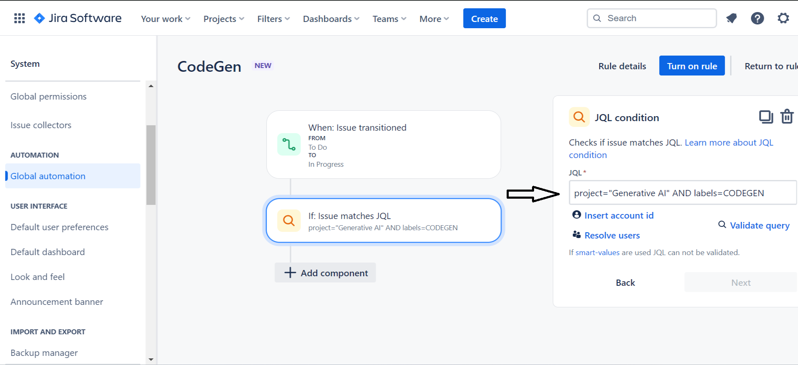


- Please choose an action to send the web request.
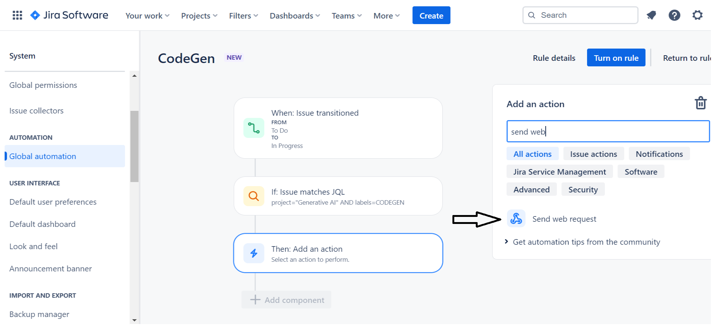


- Provide the web request URL, method, custom data, and specify the header containing the 'x-api-key' key with its corresponding actual API key, as illustrated in the accompanying image
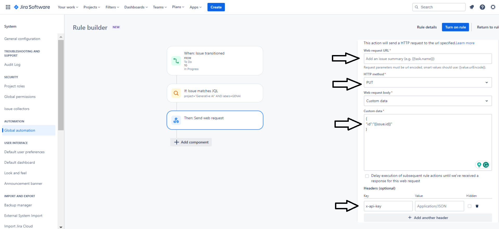


```json
{
  "id": "{{issue.id}}"
}
```

- Afterwards, proceed by clicking the 'Next' button, then activate the rule by providing the Rule name and edit access for the rule.
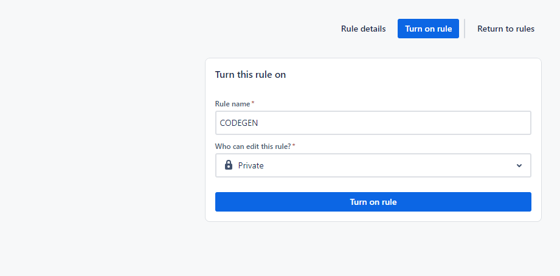

**2. Integrate Jira with the GitHub repository.**


- Navigate to the code option in the development group and choose 'Connect to other Providers'
- If you are not facing any issue after clicking on this you will directly navigate to the Marketplace or else click on the Marketplace link in the bottom.
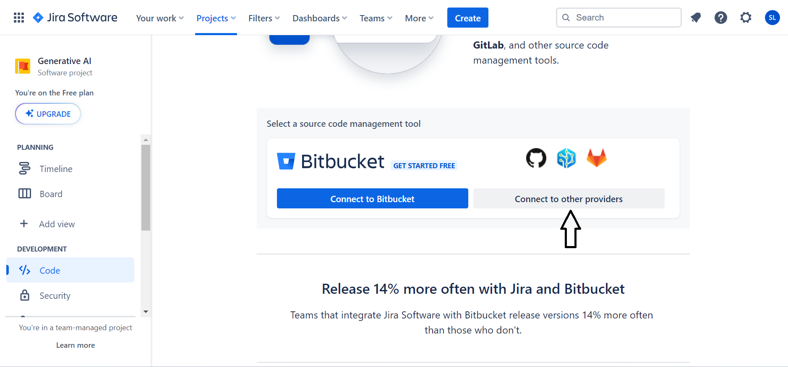


[//]: # (- Click on the browse the atlassian Marketplace.)

[//]: # (![marketPlace]&#40;marketPlace.png&#41;)


- Click on the GitHub for jira
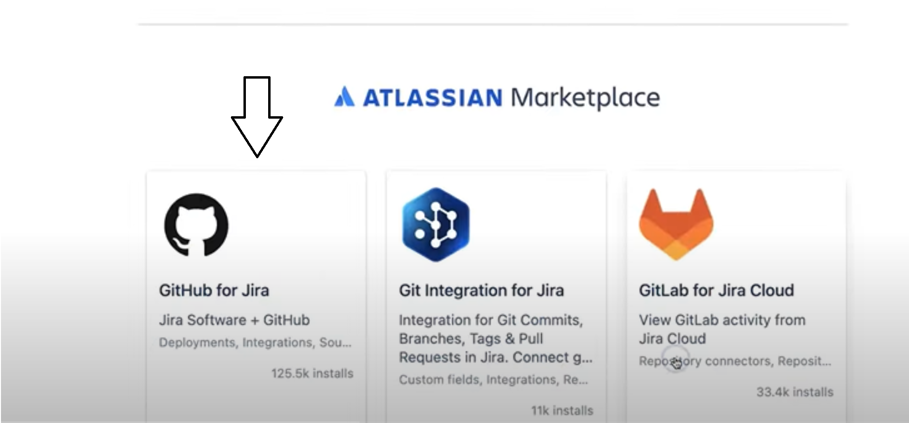


- Click on the 'Get it now' button after the app in installed click on the get started button.
- Then connect your GitHub with the jira by clicking on the continue.
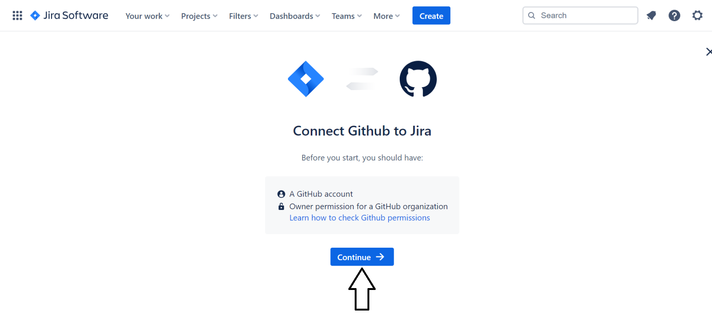


- Select your GitHub product then click on the next button.
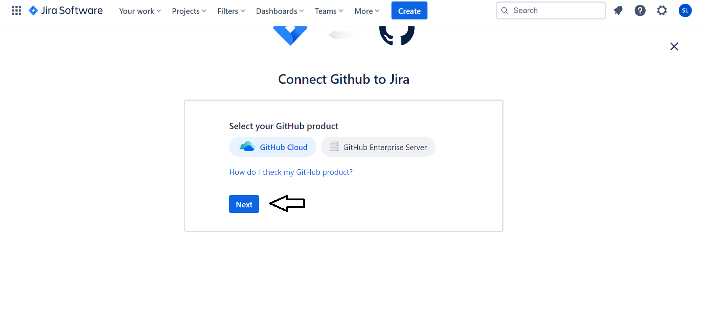


- Connect to the GitHub Organization of your repository.
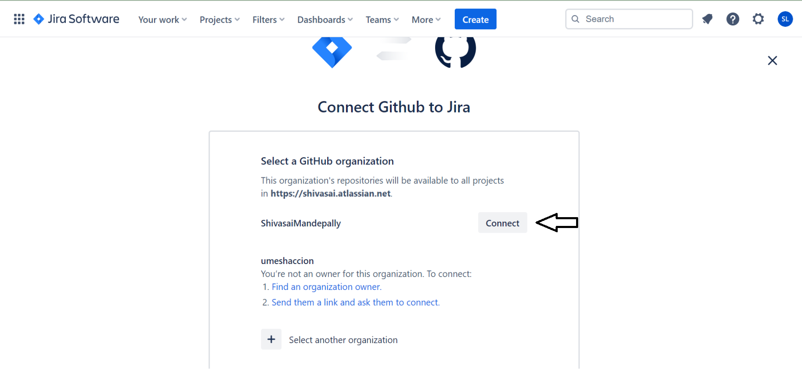


- After the connection of your GitHub to jira, click on the edit option in the GitHub configuration.
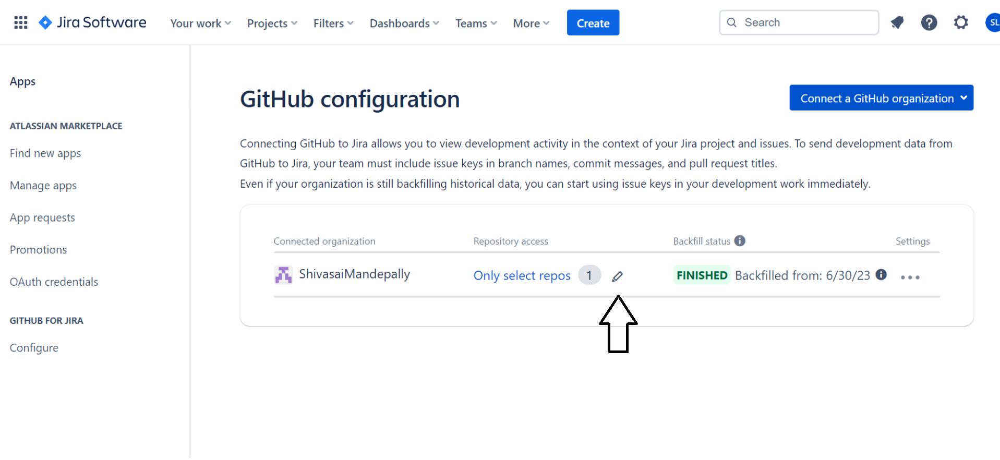


- It will redirect you to the GitHub there give access to the repository which you want to connect with jira.
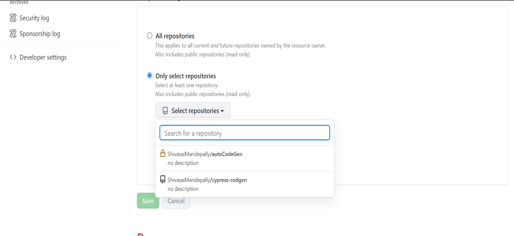


***Your GitHub-Jira connection is now established. Any commits made in the selected repository with a JIRA story key will be reflected in JIRA***


**3. Using CODEGEN for the first time.**
\
After the creation of the rule and successful integration of GitHub with Jira

- Create a user story and apply the specified label mentioned during rule creation.
- Attach the Swagger file within the user story.
- Transition the status from TODO to IN PROGRESS.
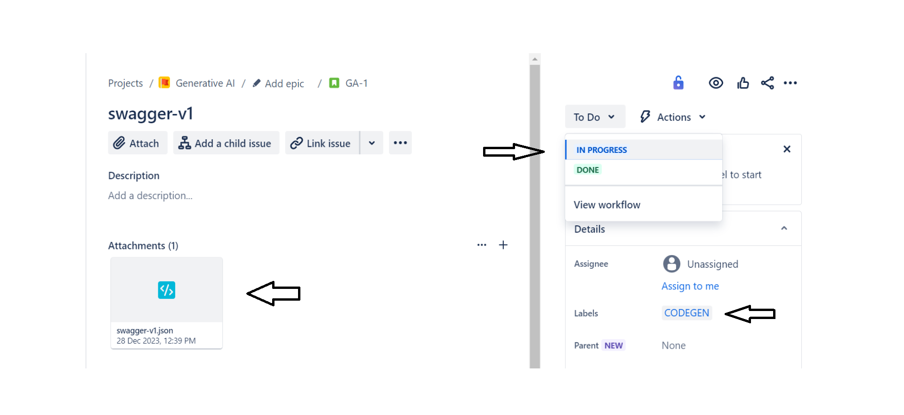

In a matter of seconds on GitHub, a new branch will be generated using the key name of your story, accompanied by the initiation of a pull request.
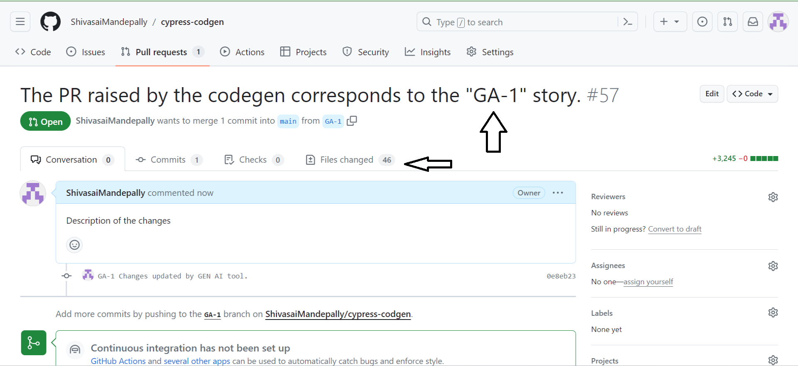

***After refreshing your Jira website, you'll observe a commit,branch and pull request linked to the user story.***
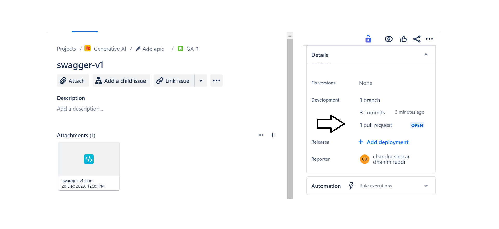


After the PR is raised, the QA engineer will review the code, and provide the input values for the configuration variables in fixture files, and subsequently assign it to the QA lead/manager. Upon approval, the QA lead/manager will proceed to merge it into the main branch
\
\
**4. Using CODEGEN for the UPDATES.**

After the initial use of the codegen tool, for subsequent API updates or additions, please follow the procedure below..
- Create another story with the same label as what you have used earlier.
- Add the modified swagger file along with delta.json
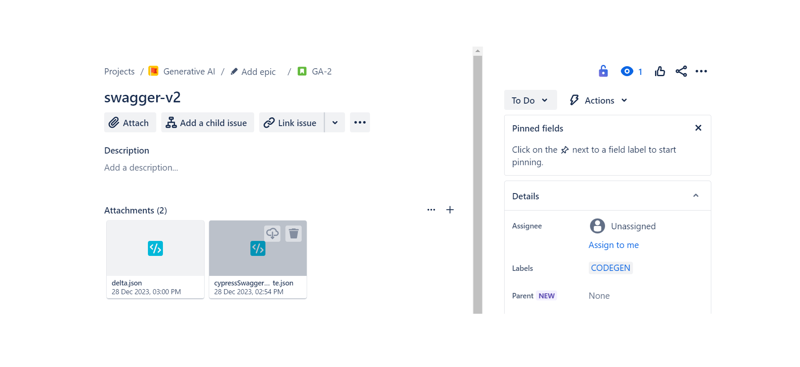
\
\
**In the delta file, document the objects that have been created, updated, or deleted.**

***Sample delta file***:
```json
{
  "serverUrl": "https://petstore.swagger.io/v2",
  "operation": "UPDATE",
  "updateInfo": [
    {
      "tags": [
        "pets"
      ],
      "methods": [
        "get"
      ],
      "apiEndpoint": "/pet/findByStatus",
      "operationId": "findPetsByStatus",
      "operation": "UPDATE"
    },
    {
      "tags": [
        "pets"
      ],
      "methods": [
        "put"
      ],
      "apiEndpoint": "/pet/{petId}",
      "operation": "CREATE"
    },
    {
      "tags": [
        "pets"
      ],
      "methods": [
        "get"
      ],
      "apiEndpoint": "/pet/findByTags",
      "operation": "DELETE"
    }
  ]
}
```

Shortly after, a new branch will be created, named after the JIRA key, and a pull request will be initiated.

This is the process to perform updates for the Cypress code within the regression process.

